# FitCoach

채용공고와 지원자의 경험을 연결해 자기소개서 개선 방향을 제안하는 AI 자기소개서 코치

FitCoach는 AI가 자기소개서를 대신 작성하는 서비스가 아닙니다.  
사용자의 기존 자기소개서와 지원하려는 채용공고를 분석하여 어떤 경험을 강조하고, 어떤 부분을 보완하거나 축소할지 제안합니다.  
최종적인 자기소개서 수정과 판단은 사용자가 직접 수행합니다.

---

## Product Preview

<p align="center">
  <a href="./docs/images/FitCoach_08.png">
    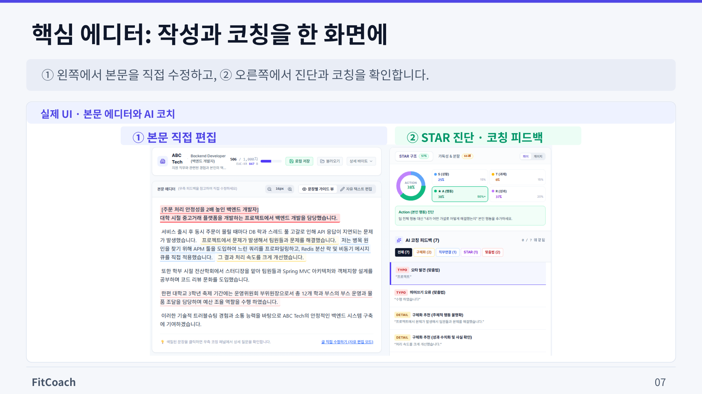
  </a>
</p>

---

## Why FitCoach?

일반적인 AI 자기소개서 도구가 완성된 문장을 생성하는 데 집중한다면, FitCoach는 사용자가 자신의 경험을 직접 작성하고 개선하도록 돕는 것을 목표로 합니다.

### 핵심 원칙
- **AI가 자기소개서를 대신 작성하지 않습니다.**
- **AI는 개선 방향과 이유를 제안합니다.**
- **사용자의 경험을 임의로 만들어내지 않습니다.**
- **존재하지 않는 성과나 수치를 생성하지 않습니다.**
- **최종 수정과 판단은 사용자가 직접 합니다.**

---

## Features

- **채용공고 및 자기소개서 분석**: 지원하려는 채용공고의 핵심 요구역량과 기존 자기소개서 간의 연관성을 분석합니다.
- **경험 우선순위 제안**: 경험과 문단을 4가지 방향(**강조**, **유지**, **보완**, **축소**)으로 분류하고, AI가 그렇게 판단한 근거와 실행 조언을 함께 제공합니다.
- **실시간 AI 코치 (AI Coach)**: 사용자가 자기소개서를 직접 편집하는 동안 구체화 질문, 직무 연결점, 맞춤법/오타, 가독성, 반복 표현 교정 포인트를 제안합니다. (AI가 사용자의 글을 임의로 덮어쓰지 않습니다.)
- **STAR 프레임워크 진단**: Situation, Task, Action, Result 구조를 기반으로 경험 서술에서 부족한 부분을 점검하고, 본인이 직접 주도한 Action 비중이 충분한지 확인합니다.
- **문장 가독성 및 글자 수 카운터**: 실시간 공백 포함/제외 글자 수, 대기업 채용 사이트 기준 EUC-KR 및 UTF-8 바이트를 자동 환산하며 장문 분할을 제안합니다.
- **AI 대필 검사 (AI Detector)**: 채용 서류 평가 관점에서 진솔한 개인의 경험(Human Voice)이 충분히 드러나 있는지 점검하고 AI 상투구를 진단합니다.
- **제출 전 최종 검토 (Final Review)**: 제출 전 6개 핵심 영역 체크리스트를 확인하고 Word(`.doc`), Markdown(`.md`), PDF/인쇄 형식으로 내보낼 수 있습니다.
- **로컬 저장 및 백업**: 외부 서버 데이터베이스에 개인정보를 저장하지 않고, 브라우저 로컬 저장소(LocalStorage) 기반의 자동 저장 및 JSON 백업/불러오기를 지원합니다.

---

## Workflow

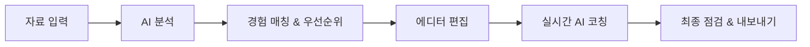

1. **자료 입력**: 지원 회사, 직무, 자기소개서 문항, 글자 수 제한, 초안을 입력합니다. (샘플 데이터 체험 지원)
2. **AI 분석**: 채용공고의 요구역량과 초안 속 경험 키워드를 분석합니다.
3. **경험 매칭 & 우선순위**: 각 경험의 적합도에 따른 강조/유지/보완/축소 추천과 구체적 사유를 확인합니다.
4. **에디터 편집**: 본문 에디터에서 글자 수 및 바이트를 확인하며 문장을 직접 작성합니다.
5. **실시간 AI 코칭**: STAR 비율 진단, 가독성 분석, 문장 분할, 오타 교정 피드백을 참고하여 내용을 다듬습니다.
6. **최종 점검 & 내보내기**: 제출 전 자가 진단 및 AI 대필 감지 검사를 거친 후 원하는 문서 포맷으로 다운로드합니다.

---

## Tech Stack

### Frontend
- **React 19**
- **TypeScript**
- **Vite**
- **Tailwind CSS (v4)**
- **Lucide React** (아이콘)

### Backend
- **Node.js (v18+)**
- **Express**

### AI
- **Google Gemini API** (`@google/genai`)

---

## Architecture

```text
┌─────────────────────────┐
│   React Frontend (SPA)  │
│  (Vite + Tailwind CSS)  │
└────────────┬────────────┘
             │ HTTP REST API (/api/ai/coach, /api/ai/detect)
             ▼
┌─────────────────────────┐
│  Node.js Express Server │
│       (server.ts)       │
└────────────┬────────────┘
             │ Google Gen AI SDK
             ▼
┌─────────────────────────┐
│    Google Gemini API    │
└─────────────────────────┘
```

- 클라이언트 브라우저 번들에 Gemini API 키가 노출되지 않도록 Express 백엔드 서버를 통해 API 호출을 중계합니다.
- 백엔드 서버는 `process.env.GEMINI_API_KEY` 환경변수를 사용하여 Google Gemini API와 안전하게 통신합니다.

---

## Getting Started

### 요구 사항
- Node.js 18 이상
- npm 9 이상

### 1. Repository 복제
```bash
git clone https://github.com/sh11025/Fitcoach.git
cd Fitcoach
```

### 2. 의존성 설치
```bash
npm install
```

### 3. 환경변수 설정
`.env.example` 파일을 복사하여 `.env` 파일을 생성합니다.

- **Mac / Linux:**
  ```bash
  cp .env.example .env
  ```
- **Windows (PowerShell):**
  ```powershell
  Copy-Item .env.example .env
  ```

생성된 `.env` 파일에 발급받은 Google Gemini API Key를 설정합니다:
```env
GEMINI_API_KEY=your_gemini_api_key_here
PORT=3000
```
*(참고: API 키가 없어도 화면 UI에서 직접 키를 입력하거나 기본 탑재된 샘플 데이터로 모든 기능을 테스트할 수 있습니다.)*

### 4. 개발 서버 실행
```bash
npm run dev
```
브라우저에서 `http://localhost:3000`으로 접속합니다.

### 5. 프로덕션 빌드
```bash
npm run build
```
빌드 결과물은 `dist/` 디렉터리에 생성됩니다.

---

## Environment Variables

| 변수명 | 설명 | 필수 여부 | 기본값 |
| :--- | :--- | :---: | :--- |
| `GEMINI_API_KEY` | Google Gemini API 인증 키 (실시간 AI 코칭 및 대필 검사 시 필요) | 선택 (미설정 시 UI에서 직접 입력 가능) | 없음 |
| `PORT` | 백엔드 Express 서버 포트 번호 | 선택 | `3000` |

---

## Project Structure

```text
Fitcoach/
├── src/
│   ├── components/        # UI 컴포넌트
│   │   ├── common/        # 공통 모달 및 세부 카드 컴포넌트
│   │   └── steps/         # 6단계 메인 플로우 컴포넌트
│   ├── data/              # 초기 Mock 및 샘플 데이터
│   ├── styles/            # 테마 및 디자인 토큰 설정
│   ├── types/             # TypeScript 인터페이스 및 타입 정의
│   ├── utils/             # 텍스트 분석, STAR 진단, 문서 내보내기 유틸리티
│   ├── App.tsx            # 메인 애플리케이션 컴포넌트
│   ├── index.css          # Tailwind CSS 및 커스텀 스타일
│   └── main.tsx           # React 엔트리포인트
├── server.ts              # Express API 서버 및 Gemini 연동
├── index.html             # HTML 템플릿
├── vite.config.ts         # Vite 빌드 설정
├── tsconfig.json          # TypeScript 컴파일러 설정
├── package.json           # 프로젝트 메타데이터 및 의존성
├── .env.example           # 환경변수 예시 파일
├── .gitignore             # Git 제외 파일 목록
└── README.md              # 프로젝트 안내 문서
```

---

## AI Usage & Privacy

- **AI 역할의 한계**: FitCoach의 AI는 지원자의 자기소개서를 대필하거나 문장을 자동으로 완성해주지 않으며, 오직 수정 방향과 코칭 피드백을 제공합니다.
- **결과 검토의 책임**: AI가 생성한 조언과 피드백은 모델의 특성상 불완전할 수 있으므로, 최종적인 수정과 내용 반영 여부는 사용자가 직접 검토하고 결정해야 합니다.
- **데이터 처리 및 보관**: 작성 중인 자기소개서 내용과 입력 정보는 외부 데이터베이스에 저장되지 않으며, 사용자의 브라우저 로컬 저장소(LocalStorage)에만 저장됩니다.

---

## Project Status

현재 FitCoach는 핵심 자기소개서 분석, 실시간 에디터, AI 코칭 및 서류 검토 플로우가 구현된 상태입니다.

---

## Project Presentation

FitCoach의 기획 배경, 핵심 기능, 사용자 흐름 및 기술 구조를 정리한 프로젝트 소개 자료입니다.

<table>
  <tr>
    <td width="50%" align="center">
      <a href="./docs/images/FitCoach_01.png">
        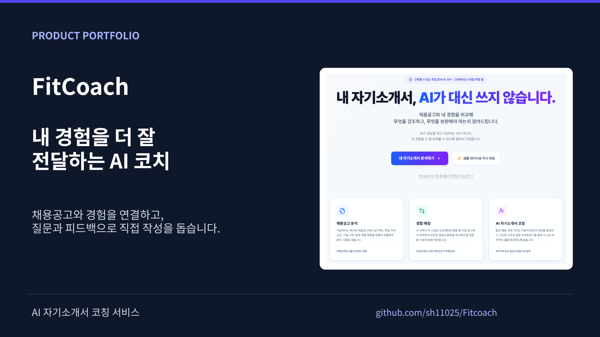
      </a>
      <br />
      <sub><b>01. FitCoach Overview</b></sub>
    </td>
    <td width="50%" align="center">
      <a href="./docs/images/FitCoach_02.png">
        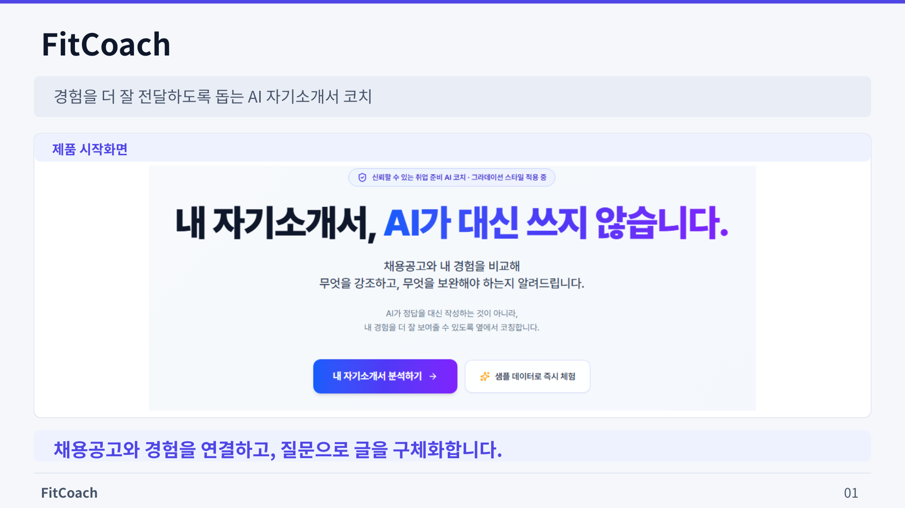
      </a>
      <br />
      <sub><b>02. 서비스 소개 및 시작 화면</b></sub>
    </td>
  </tr>
  <tr>
    <td width="50%" align="center">
      <a href="./docs/images/FitCoach_03.png">
        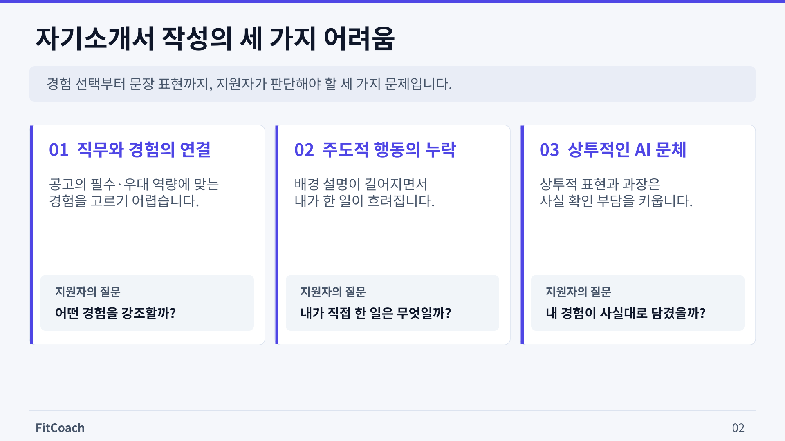
      </a>
      <br />
      <sub><b>03. 문제 정의 (자소서 작성의 한계)</b></sub>
    </td>
    <td width="50%" align="center">
      <a href="./docs/images/FitCoach_04.png">
        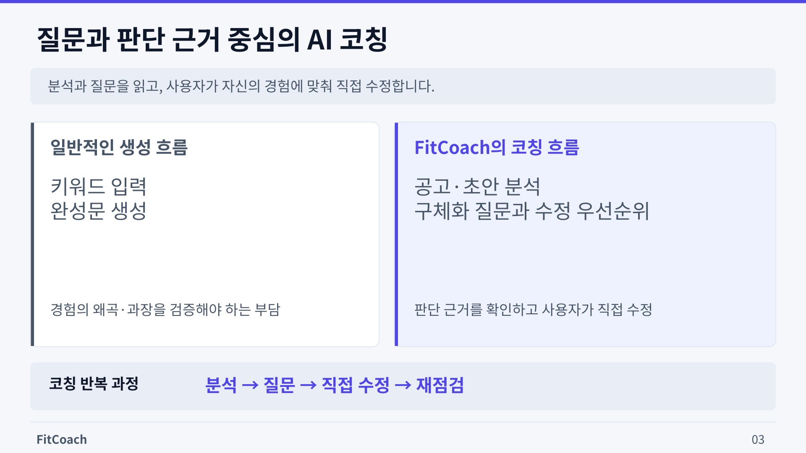
      </a>
      <br />
      <sub><b>04. 해결 방안 (AI Coaching 패러다임)</b></sub>
    </td>
  </tr>
  <tr>
    <td width="50%" align="center">
      <a href="./docs/images/FitCoach_05.png">
        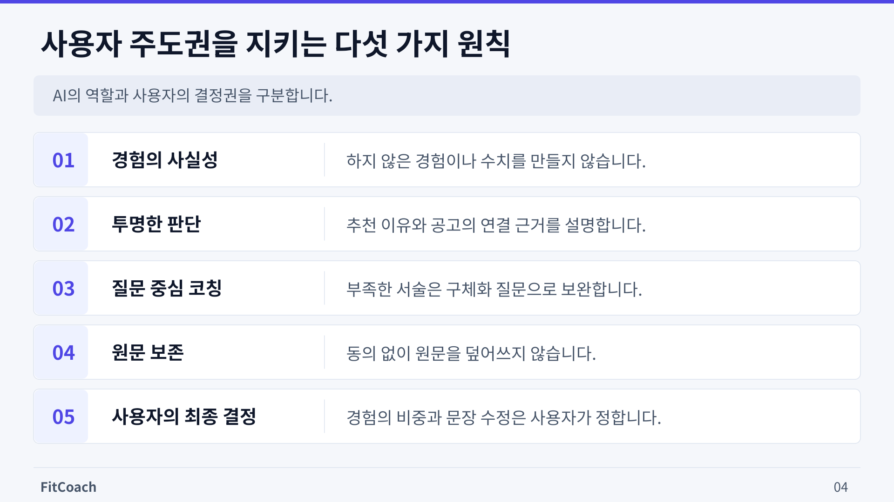
      </a>
      <br />
      <sub><b>05. 제품 핵심 철학 (5대 원칙)</b></sub>
    </td>
    <td width="50%" align="center">
      <a href="./docs/images/FitCoach_06.png">
        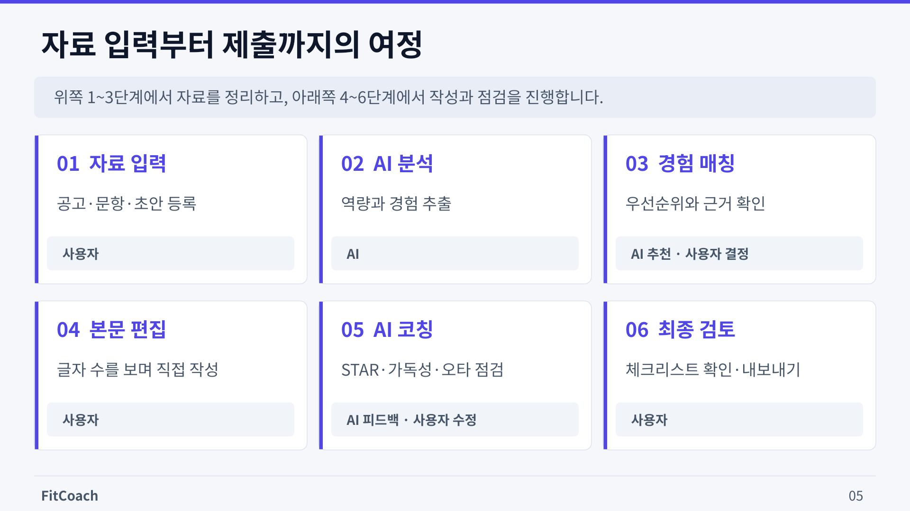
      </a>
      <br />
      <sub><b>06. 사용자 흐름 (6단계 워크플로우)</b></sub>
    </td>
  </tr>
  <tr>
    <td width="50%" align="center">
      <a href="./docs/images/FitCoach_07.png">
        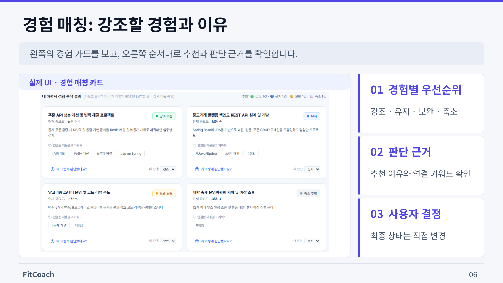
      </a>
      <br />
      <sub><b>07. 경험 매칭 (우선순위 & 추천 사유)</b></sub>
    </td>
    <td width="50%" align="center">
      <a href="./docs/images/FitCoach_08.png">
        
      </a>
      <br />
      <sub><b>08. 핵심 에디터 (작성 & 실시간 코칭)</b></sub>
    </td>
  </tr>
  <tr>
    <td width="50%" align="center">
      <a href="./docs/images/FitCoach_09.png">
        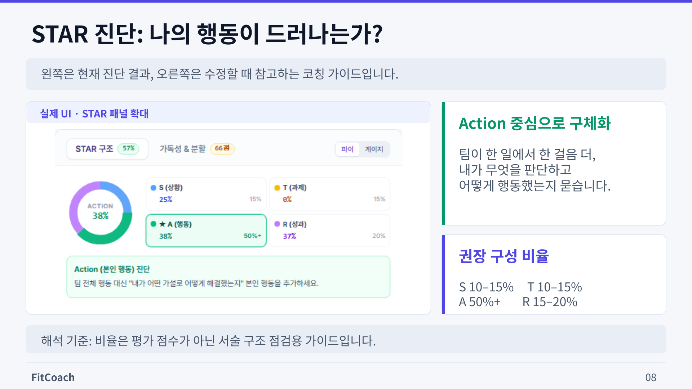
      </a>
      <br />
      <sub><b>09. STAR 진단 (Action 중심 분석)</b></sub>
    </td>
    <td width="50%" align="center">
      <a href="./docs/images/FitCoach_10.png">
        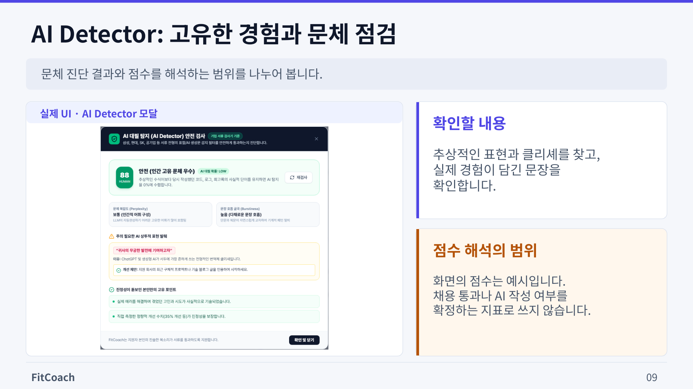
      </a>
      <br />
      <sub><b>10. AI Detector (고유 경험 & 대필 점검)</b></sub>
    </td>
  </tr>
  <tr>
    <td width="50%" align="center">
      <a href="./docs/images/FitCoach_11.png">
        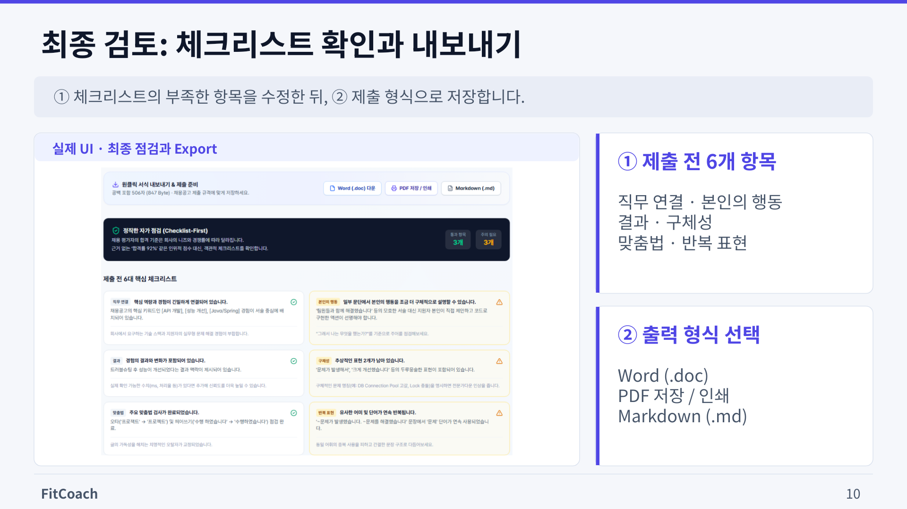
      </a>
      <br />
      <sub><b>11. 최종 검토 (체크리스트 & 내보내기)</b></sub>
    </td>
    <td width="50%" align="center">
      <a href="./docs/images/FitCoach_12.png">
        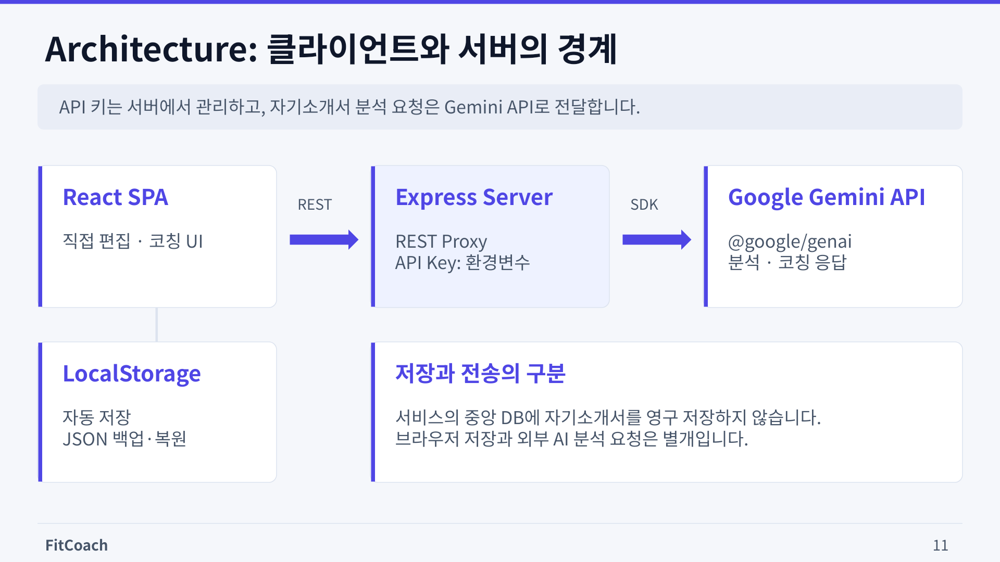
      </a>
      <br />
      <sub><b>12. 시스템 아키텍처 & 프라이버시</b></sub>
    </td>
  </tr>
  <tr>
    <td width="50%" align="center">
      <a href="./docs/images/FitCoach_13.png">
        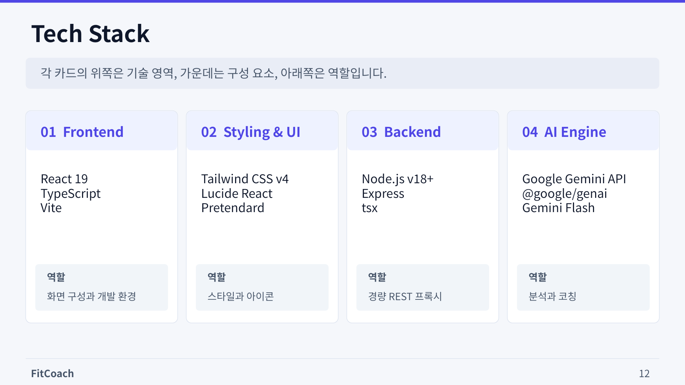
      </a>
      <br />
      <sub><b>13. 기술 스택 (Tech Stack)</b></sub>
    </td>
    <td width="50%" align="center">
      <a href="./docs/images/FitCoach_14.png">
        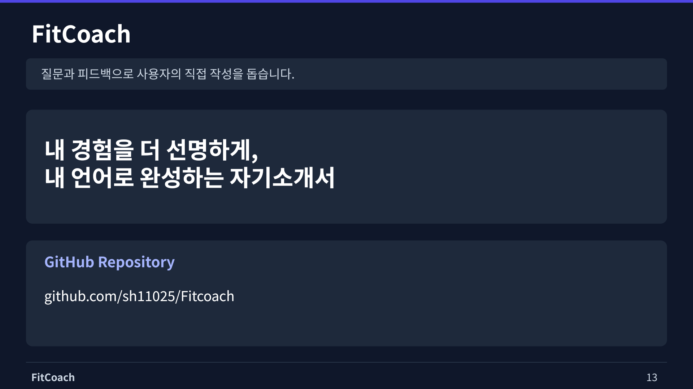
      </a>
      <br />
      <sub><b>14. 프로젝트 클로징 (Closing)</b></sub>
    </td>
  </tr>
</table>

---

## License

Copyright © 2026 sh11025. All rights reserved.

FitCoach는 소스 코드를 프로젝트 열람, 기술 검토 및 학습 참고 목적으로 공개하는 source-available project입니다.  
저작권자의 사전 서면 허가 없이 소스 코드의 복제, 수정, 재배포, 상업적 이용 또는 이를 기반으로 한 파생 제품·서비스의 제작 및 운영을 허용하지 않습니다.

자세한 이용 조건은 [LICENSE](./LICENSE)를 확인해 주세요.
